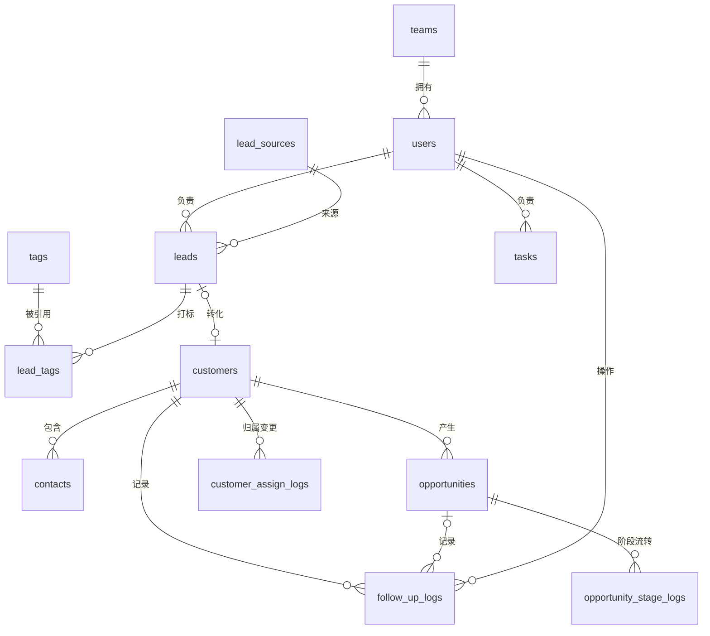

# CRM 线索管控模块 — 数据表结构设计

> 依据《CRM 线索管控模块需求规格说明书 v1.0》整理。

## 1. 设计约定

| 项    | 约定                                      |
| ---- | --------------------------------------- |
| 数据库  | MySQL 8.0                               |
| 字符集  | utf8mb4 / utf8mb4\_general\_ci          |
| 命名   | 表名、字段名一律 snake\_case（小写下划线）             |
| 主键   | `id BIGINT AUTO_INCREMENT`              |
| 通用字段 | `created_at`（创建时间）、`updated_at`（更新时间）   |
| 状态字段 | 使用 `VARCHAR` 存储，取值由应用层枚举常量约束（便于扩展与跨库迁移） |
| 外键   | DDL 中声明外键约束；若团队习惯应用层维护关系，可仅保留索引、去掉外键    |

***

## 2. 表清单

| #  | 表名                       | 中文名      | 对应需求            |
| -- | ------------------------ | -------- | --------------- |
| 1  | teams                    | 团队       | 角色权限（团队维度）      |
| 2  | users                    | 用户       | 角色权限（销售/主管/管理员） |
| 3  | lead\_sources            | 线索来源渠道字典 | 线索池·来源标记        |
| 4  | tags                     | 标签字典     | 线索池·标签          |
| 5  | leads                    | 线索       | 线索池             |
| 6  | lead\_tags               | 线索-标签关联  | 线索池·标签          |
| 7  | customers                | 客户       | 客户池 / 客户档案      |
| 8  | contacts                 | 联系人      | 客户档案            |
| 9  | follow\_up\_logs         | 跟进记录     | 客户档案·沟通沉淀       |
| 10 | opportunities            | 商机       | 商机管理            |
| 11 | opportunity\_stage\_logs | 商机阶段流转日志 | 商机·阶段留痕         |
| 12 | tasks                    | 任务/日报/待办 | 日程管理            |
| 13 | customer\_assign\_logs   | 客户归属变更日志 | 客户池·移交留痕        |
| 14 | sys\_configs             | 系统配置     | 公海/提醒阈值可配置      |

***

## 3. 实体关系（ER）



***

## 4. 详细字段定义

### 4.1 teams（团队）

| 字段          | 类型          | 约束       | 说明             |
| ----------- | ----------- | -------- | -------------- |
| id          | BIGINT      | PK, AUTO | 主键             |
| name        | VARCHAR(64) | NOT NULL | 团队名称           |
| leader\_id  | BIGINT      | NULL     | 团队负责人（主管）用户 ID |
| created\_at | DATETIME    | NOT NULL | 创建时间           |
| updated\_at | DATETIME    | NOT NULL | 更新时间           |

### 4.2 users（用户）

| 字段             | 类型           | 约束               | 说明                         |
| -------------- | ------------ | ---------------- | -------------------------- |
| id             | BIGINT       | PK, AUTO         | 主键                         |
| username       | VARCHAR(64)  | NOT NULL, UNIQUE | 登录名                        |
| password\_hash | VARCHAR(255) | NOT NULL         | 密码哈希                       |
| name           | VARCHAR(64)  | NOT NULL         | 姓名                         |
| role           | VARCHAR(16)  | NOT NULL         | 角色：sales / manager / admin |
| team\_id       | BIGINT       | NULL, FK→teams   | 所属团队                       |
| phone          | VARCHAR(32)  | NULL             | 手机号                        |
| status         | VARCHAR(16)  | NOT NULL         | active / disabled          |
| created\_at    | DATETIME     | NOT NULL         | 创建时间                       |
| updated\_at    | DATETIME     | NOT NULL         | 更新时间                       |

### 4.3 lead\_sources（线索来源渠道字典）

| 字段          | 类型          | 约束                 | 说明                       |
| ----------- | ----------- | ------------------ | ------------------------ |
| id          | BIGINT      | PK, AUTO           | 主键                       |
| name        | VARCHAR(64) | NOT NULL           | 渠道名称（官网/广告/展会/社媒/转介绍/导入） |
| code        | VARCHAR(32) | NOT NULL, UNIQUE   | 渠道编码                     |
| sort        | INT         | NOT NULL DEFAULT 0 | 排序                       |
| enabled     | TINYINT(1)  | NOT NULL DEFAULT 1 | 是否启用                     |
| created\_at | DATETIME    | NOT NULL           | 创建时间                     |
| updated\_at | DATETIME    | NOT NULL           | 更新时间                     |

### 4.4 tags（标签字典）

| 字段          | 类型          | 约束                      | 说明           |
| ----------- | ----------- | ----------------------- | ------------ |
| id          | BIGINT      | PK, AUTO                | 主键           |
| name        | VARCHAR(64) | NOT NULL                | 标签名          |
| type        | VARCHAR(16) | NOT NULL DEFAULT 'lead' | 标签类型（如 lead） |
| created\_at | DATETIME    | NOT NULL                | 创建时间         |
| updated\_at | DATETIME    | NOT NULL                | 更新时间         |

### 4.5 leads（线索）

| 字段          | 类型           | 约束                     | 说明         |
| ----------- | ------------ | ---------------------- | ---------- |
| id          | BIGINT       | PK, AUTO               | 主键         |
| name        | VARCHAR(64)  | NOT NULL               | 联系人姓名      |
| company     | VARCHAR(128) | NULL                   | 公司         |
| phone       | VARCHAR(32)  | NULL, INDEX            | 电话（查重精确匹配） |
| email       | VARCHAR(128) | NULL, INDEX            | 邮箱（查重精确匹配） |
| source\_id  | BIGINT       | NULL, FK→lead\_sources | 来源渠道       |
| status      | VARCHAR(16)  | NOT NULL, INDEX        | 状态（见 4.15） |
| owner\_id   | BIGINT       | NULL, FK→users, INDEX  | 负责人        |
| remark      | TEXT         | NULL                   | 备注         |
| created\_by | BIGINT       | NULL                   | 创建人用户 ID   |
| created\_at | DATETIME     | NOT NULL               | 采集/创建时间    |
| updated\_at | DATETIME     | NOT NULL               | 更新时间       |

### 4.6 lead\_tags（线索-标签关联）

| 字段       | 类型     | 约束           | 说明    |
| -------- | ------ | ------------ | ----- |
| lead\_id | BIGINT | PK, FK→leads | 线索 ID |
| tag\_id  | BIGINT | PK, FK→tags  | 标签 ID |

> 联合主键 `(lead_id, tag_id)`。

### 4.7 customers（客户）

| 字段                   | 类型           | 约束                    | 说明                |
| -------------------- | ------------ | --------------------- | ----------------- |
| id                   | BIGINT       | PK, AUTO              | 主键                |
| name                 | VARCHAR(128) | NOT NULL              | 客户名称              |
| industry             | VARCHAR(64)  | NULL                  | 行业                |
| phone                | VARCHAR(32)  | NULL, INDEX           | 电话                |
| email                | VARCHAR(128) | NULL                  | 邮箱                |
| status               | VARCHAR(16)  | NOT NULL, INDEX       | 归属状态（见 4.15）      |
| owner\_id            | BIGINT       | NULL, FK→users, INDEX | 负责人               |
| lead\_id             | BIGINT       | NULL, FK→leads        | 来源线索（转化）          |
| last\_follow\_up\_at | DATETIME     | NULL                  | 最近跟进时间（公海/时效判定依据） |
| remark               | TEXT         | NULL                  | 备注                |
| created\_at          | DATETIME     | NOT NULL              | 创建时间              |
| updated\_at          | DATETIME     | NOT NULL              | 更新时间              |

### 4.8 contacts（联系人）

| 字段                  | 类型           | 约束                            | 说明    |
| ------------------- | ------------ | ----------------------------- | ----- |
| id                  | BIGINT       | PK, AUTO                      | 主键    |
| customer\_id        | BIGINT       | NOT NULL, FK→customers, INDEX | 所属客户  |
| name                | VARCHAR(64)  | NOT NULL                      | 姓名    |
| position            | VARCHAR(64)  | NULL                          | 职位    |
| phone               | VARCHAR(32)  | NULL                          | 电话    |
| email               | VARCHAR(128) | NULL                          | 邮箱    |
| is\_decision\_maker | TINYINT(1)   | NOT NULL DEFAULT 0            | 是否决策人 |
| created\_at         | DATETIME     | NOT NULL                      | 创建时间  |
| updated\_at         | DATETIME     | NOT NULL                      | 更新时间  |

### 4.9 follow\_up\_logs（跟进记录，统一时间线）

| 字段               | 类型            | 约束                            | 说明                                              |
| ---------------- | ------------- | ----------------------------- | ----------------------------------------------- |
| id               | BIGINT        | PK, AUTO                      | 主键                                              |
| customer\_id     | BIGINT        | NOT NULL, FK→customers, INDEX | 关联客户                                            |
| opportunity\_id  | BIGINT        | NULL, FK→opportunities        | 关联商机（可空）                                        |
| record\_type     | VARCHAR(16)   | NOT NULL                      | 类型：email / social / quote / phone / visit / log |
| content          | TEXT          | NULL                          | 沟通内容 / 日志备注                                     |
| amount           | DECIMAL(12,2) | NULL                          | 报价金额（record\_type=quote）                        |
| attachment       | VARCHAR(255)  | NULL                          | 附件路径                                            |
| next\_follow\_at | DATETIME      | NULL                          | 下次跟进时间                                          |
| operator\_id     | BIGINT        | NULL, FK→users                | 操作人                                             |
| created\_at      | DATETIME      | NOT NULL                      | 记录时间                                            |
| updated\_at      | DATETIME      | NOT NULL                      | 修订时间                                            |

### 4.10 opportunities（商机）

| 字段                    | 类型            | 约束                            | 说明             |
| --------------------- | ------------- | ----------------------------- | -------------- |
| id                    | BIGINT        | PK, AUTO                      | 主键             |
| customer\_id          | BIGINT        | NOT NULL, FK→customers, INDEX | 关联客户           |
| name                  | VARCHAR(128)  | NOT NULL                      | 商机名称           |
| inquiry               | TEXT          | NULL                          | 客户询盘内容         |
| product               | VARCHAR(128)  | NULL                          | 意向产品           |
| budget                | DECIMAL(12,2) | NULL                          | 预算             |
| stage                 | VARCHAR(16)   | NOT NULL, INDEX               | 阶段（见 4.15）     |
| expected\_close\_date | DATE          | NULL                          | 预计成交日期（到期提醒依据） |
| owner\_id             | BIGINT        | NULL, FK→users, INDEX         | 负责人            |
| remark                | TEXT          | NULL                          | 备注             |
| created\_at           | DATETIME      | NOT NULL                      | 创建时间           |
| updated\_at           | DATETIME      | NOT NULL                      | 更新时间           |

### 4.11 opportunity\_stage\_logs（商机阶段流转日志）

| 字段              | 类型          | 约束                                | 说明        |
| --------------- | ----------- | --------------------------------- | --------- |
| id              | BIGINT      | PK, AUTO                          | 主键        |
| opportunity\_id | BIGINT      | NOT NULL, FK→opportunities, INDEX | 商机 ID     |
| from\_stage     | VARCHAR(16) | NULL                              | 原阶段       |
| to\_stage       | VARCHAR(16) | NOT NULL                          | 新阶段       |
| remark          | TEXT        | NULL                              | 备注（失败原因等） |
| operator\_id    | BIGINT      | NULL, FK→users                    | 操作人       |
| created\_at     | DATETIME    | NOT NULL                          | 流转时间      |

### 4.12 tasks（任务/日报/待办）

| 字段            | 类型           | 约束                    | 说明                                |
| ------------- | ------------ | --------------------- | --------------------------------- |
| id            | BIGINT       | PK, AUTO              | 主键                                |
| title         | VARCHAR(255) | NOT NULL              | 标题                                |
| type          | VARCHAR(16)  | NOT NULL              | 类型：daily / todo / prospect        |
| content       | TEXT         | NULL                  | 日报内容 / 任务详情                       |
| owner\_id     | BIGINT       | NULL, FK→users, INDEX | 负责人                               |
| related\_type | VARCHAR(32)  | NULL                  | 关联对象类型（lead/customer/opportunity） |
| related\_id   | BIGINT       | NULL                  | 关联对象 ID                           |
| due\_at       | DATETIME     | NULL                  | 截止时间                              |
| remind\_at    | DATETIME     | NULL                  | 提醒时间                              |
| done          | TINYINT(1)   | NOT NULL DEFAULT 0    | 是否完成                              |
| created\_at   | DATETIME     | NOT NULL              | 创建时间                              |
| updated\_at   | DATETIME     | NOT NULL              | 更新时间                              |

### 4.13 customer\_assign\_logs（客户归属变更日志）

| 字段              | 类型          | 约束                            | 说明                                       |
| --------------- | ----------- | ----------------------------- | ---------------------------------------- |
| id              | BIGINT      | PK, AUTO                      | 主键                                       |
| customer\_id    | BIGINT      | NOT NULL, FK→customers, INDEX | 客户 ID                                    |
| from\_owner\_id | BIGINT      | NULL                          | 原负责人                                     |
| to\_owner\_id   | BIGINT      | NULL                          | 新负责人                                     |
| action          | VARCHAR(16) | NOT NULL                      | 动作：assign / transfer / reclaim / recycle |
| operator\_id    | BIGINT      | NULL                          | 操作人                                      |
| remark          | TEXT        | NULL                          | 备注                                       |
| created\_at     | DATETIME    | NOT NULL                      | 变更时间                                     |

### 4.14 sys\_configs（系统配置）

| 字段          | 类型           | 约束               | 说明   |
| ----------- | ------------ | ---------------- | ---- |
| id          | BIGINT       | PK, AUTO         | 主键   |
| key         | VARCHAR(64)  | NOT NULL, UNIQUE | 配置键  |
| value       | VARCHAR(255) | NOT NULL         | 配置值  |
| description | VARCHAR(255) | NULL             | 说明   |
| updated\_at | DATETIME     | NOT NULL         | 更新时间 |

**预置配置项**：

| key                       | 默认值 | 说明          |
| ------------------------- | --- | ----------- |
| public\_pool\_days        | 30  | 公海回收阈值（天）   |
| reclaim\_protect\_days    | 7   | 认领保护期（天）    |
| follow\_up\_remind\_days  | 7   | 跟进时效提醒阈值（天） |
| opportunity\_remind\_days | 3   | 商机到期提醒提前天数  |
| recycle\_keep\_days       | 30  | 回收站保留时长（天）  |

***

## 5. 枚举值汇总

| 字段                            | 取值                                                                       |
| ----------------------------- | ------------------------------------------------------------------------ |
| users.role                    | sales（销售）/ manager（主管）/ admin（管理员）                                       |
| users.status                  | active / disabled                                                        |
| leads.status                  | pending（待分配）/ assigned（已分配）/ converted（已转化）/ invalid（已作废）/ recycled（回收站） |
| customers.status              | private（私有）/ public（公海）/ locked（锁定）                                      |
| opportunities.stage           | contact（初步接触）/ quotation（报价）/ negotiation（谈判）/ won（成交）/ lost（失败）         |
| follow\_up\_logs.record\_type | email / social / quote / phone / visit / log                             |
| tasks.type                    | daily（日报）/ todo（待办）/ prospect（拓客）                                        |
| customer\_assign\_logs.action | assign / transfer / reclaim / recycle                                    |

***

## 6. 索引设计

| 表                | 索引                                      | 用途        |
| ---------------- | --------------------------------------- | --------- |
| leads            | phone, email                            | 查重精确匹配    |
| leads            | company                                 | 查重模糊匹配    |
| leads            | status, owner\_id, source\_id           | 列表筛选      |
| customers        | status, owner\_id, last\_follow\_up\_at | 公海回收/时效扫描 |
| opportunities    | stage, owner\_id, expected\_close\_date | 看板/到期提醒   |
| follow\_up\_logs | customer\_id, opportunity\_id           | 时间线回溯     |
| tasks            | owner\_id                               | 个人/团队计划查询 |

***

## 7. 完整 DDL（MySQL 8.0）

```sql
-- 字符集与引擎
-- 建议库：CREATE DATABASE crm DEFAULT CHARACTER SET utf8mb4 COLLATE utf8mb4_general_ci;

CREATE TABLE teams (
  id BIGINT NOT NULL AUTO_INCREMENT,
  name VARCHAR(64) NOT NULL COMMENT '团队名称',
  leader_id BIGINT NULL COMMENT '团队负责人(主管)用户ID',
  created_at DATETIME NOT NULL DEFAULT CURRENT_TIMESTAMP,
  updated_at DATETIME NOT NULL DEFAULT CURRENT_TIMESTAMP ON UPDATE CURRENT_TIMESTAMP,
  PRIMARY KEY (id)
) ENGINE=InnoDB DEFAULT CHARSET=utf8mb4 COMMENT='团队';

CREATE TABLE users (
  id BIGINT NOT NULL AUTO_INCREMENT,
  username VARCHAR(64) NOT NULL COMMENT '登录名',
  password_hash VARCHAR(255) NOT NULL COMMENT '密码哈希',
  name VARCHAR(64) NOT NULL COMMENT '姓名',
  role VARCHAR(16) NOT NULL DEFAULT 'sales' COMMENT '角色: sales/manager/admin',
  team_id BIGINT NULL COMMENT '所属团队',
  phone VARCHAR(32) NULL,
  status VARCHAR(16) NOT NULL DEFAULT 'active' COMMENT 'active/disabled',
  created_at DATETIME NOT NULL DEFAULT CURRENT_TIMESTAMP,
  updated_at DATETIME NOT NULL DEFAULT CURRENT_TIMESTAMP ON UPDATE CURRENT_TIMESTAMP,
  PRIMARY KEY (id),
  UNIQUE KEY uk_username (username),
  KEY idx_team (team_id),
  CONSTRAINT fk_users_team FOREIGN KEY (team_id) REFERENCES teams (id)
) ENGINE=InnoDB DEFAULT CHARSET=utf8mb4 COMMENT='用户';

CREATE TABLE lead_sources (
  id BIGINT NOT NULL AUTO_INCREMENT,
  name VARCHAR(64) NOT NULL COMMENT '渠道名称',
  code VARCHAR(32) NOT NULL COMMENT '渠道编码',
  sort INT NOT NULL DEFAULT 0,
  enabled TINYINT(1) NOT NULL DEFAULT 1,
  created_at DATETIME NOT NULL DEFAULT CURRENT_TIMESTAMP,
  updated_at DATETIME NOT NULL DEFAULT CURRENT_TIMESTAMP ON UPDATE CURRENT_TIMESTAMP,
  PRIMARY KEY (id),
  UNIQUE KEY uk_code (code)
) ENGINE=InnoDB DEFAULT CHARSET=utf8mb4 COMMENT='线索来源渠道字典';

CREATE TABLE tags (
  id BIGINT NOT NULL AUTO_INCREMENT,
  name VARCHAR(64) NOT NULL COMMENT '标签名',
  type VARCHAR(16) NOT NULL DEFAULT 'lead' COMMENT '标签类型',
  created_at DATETIME NOT NULL DEFAULT CURRENT_TIMESTAMP,
  updated_at DATETIME NOT NULL DEFAULT CURRENT_TIMESTAMP ON UPDATE CURRENT_TIMESTAMP,
  PRIMARY KEY (id)
) ENGINE=InnoDB DEFAULT CHARSET=utf8mb4 COMMENT='标签字典';

CREATE TABLE leads (
  id BIGINT NOT NULL AUTO_INCREMENT,
  name VARCHAR(64) NOT NULL COMMENT '联系人姓名',
  company VARCHAR(128) NULL,
  phone VARCHAR(32) NULL,
  email VARCHAR(128) NULL,
  source_id BIGINT NULL COMMENT '来源渠道',
  status VARCHAR(16) NOT NULL DEFAULT 'pending' COMMENT 'pending/assigned/converted/invalid/recycled',
  owner_id BIGINT NULL COMMENT '负责人',
  remark TEXT NULL,
  created_by BIGINT NULL,
  created_at DATETIME NOT NULL DEFAULT CURRENT_TIMESTAMP,
  updated_at DATETIME NOT NULL DEFAULT CURRENT_TIMESTAMP ON UPDATE CURRENT_TIMESTAMP,
  PRIMARY KEY (id),
  KEY idx_phone (phone),
  KEY idx_email (email),
  KEY idx_company (company),
  KEY idx_status (status),
  KEY idx_owner (owner_id),
  KEY idx_source (source_id),
  CONSTRAINT fk_leads_source FOREIGN KEY (source_id) REFERENCES lead_sources (id),
  CONSTRAINT fk_leads_owner FOREIGN KEY (owner_id) REFERENCES users (id)
) ENGINE=InnoDB DEFAULT CHARSET=utf8mb4 COMMENT='线索';

CREATE TABLE lead_tags (
  lead_id BIGINT NOT NULL,
  tag_id BIGINT NOT NULL,
  PRIMARY KEY (lead_id, tag_id),
  CONSTRAINT fk_lead_tags_lead FOREIGN KEY (lead_id) REFERENCES leads (id) ON DELETE CASCADE,
  CONSTRAINT fk_lead_tags_tag FOREIGN KEY (tag_id) REFERENCES tags (id) ON DELETE CASCADE
) ENGINE=InnoDB DEFAULT CHARSET=utf8mb4 COMMENT='线索-标签关联';

CREATE TABLE customers (
  id BIGINT NOT NULL AUTO_INCREMENT,
  name VARCHAR(128) NOT NULL COMMENT '客户名称',
  industry VARCHAR(64) NULL,
  phone VARCHAR(32) NULL,
  email VARCHAR(128) NULL,
  status VARCHAR(16) NOT NULL DEFAULT 'private' COMMENT 'private/public/locked',
  owner_id BIGINT NULL COMMENT '负责人',
  lead_id BIGINT NULL COMMENT '来源线索',
  last_follow_up_at DATETIME NULL COMMENT '最近跟进时间',
  remark TEXT NULL,
  created_at DATETIME NOT NULL DEFAULT CURRENT_TIMESTAMP,
  updated_at DATETIME NOT NULL DEFAULT CURRENT_TIMESTAMP ON UPDATE CURRENT_TIMESTAMP,
  PRIMARY KEY (id),
  KEY idx_status (status),
  KEY idx_owner (owner_id),
  KEY idx_last_follow (last_follow_up_at),
  KEY idx_phone (phone),
  CONSTRAINT fk_customers_owner FOREIGN KEY (owner_id) REFERENCES users (id),
  CONSTRAINT fk_customers_lead FOREIGN KEY (lead_id) REFERENCES leads (id)
) ENGINE=InnoDB DEFAULT CHARSET=utf8mb4 COMMENT='客户';

CREATE TABLE contacts (
  id BIGINT NOT NULL AUTO_INCREMENT,
  customer_id BIGINT NOT NULL,
  name VARCHAR(64) NOT NULL,
  position VARCHAR(64) NULL,
  phone VARCHAR(32) NULL,
  email VARCHAR(128) NULL,
  is_decision_maker TINYINT(1) NOT NULL DEFAULT 0,
  created_at DATETIME NOT NULL DEFAULT CURRENT_TIMESTAMP,
  updated_at DATETIME NOT NULL DEFAULT CURRENT_TIMESTAMP ON UPDATE CURRENT_TIMESTAMP,
  PRIMARY KEY (id),
  KEY idx_customer (customer_id),
  CONSTRAINT fk_contacts_customer FOREIGN KEY (customer_id) REFERENCES customers (id) ON DELETE CASCADE
) ENGINE=InnoDB DEFAULT CHARSET=utf8mb4 COMMENT='联系人';

CREATE TABLE opportunities (
  id BIGINT NOT NULL AUTO_INCREMENT,
  customer_id BIGINT NOT NULL,
  name VARCHAR(128) NOT NULL COMMENT '商机名称',
  inquiry TEXT NULL COMMENT '客户询盘',
  product VARCHAR(128) NULL COMMENT '意向产品',
  budget DECIMAL(12,2) NULL COMMENT '预算',
  stage VARCHAR(16) NOT NULL DEFAULT 'contact' COMMENT 'contact/quotation/negotiation/won/lost',
  expected_close_date DATE NULL COMMENT '预计成交日期',
  owner_id BIGINT NULL,
  remark TEXT NULL,
  created_at DATETIME NOT NULL DEFAULT CURRENT_TIMESTAMP,
  updated_at DATETIME NOT NULL DEFAULT CURRENT_TIMESTAMP ON UPDATE CURRENT_TIMESTAMP,
  PRIMARY KEY (id),
  KEY idx_customer (customer_id),
  KEY idx_stage (stage),
  KEY idx_owner (owner_id),
  KEY idx_close_date (expected_close_date),
  CONSTRAINT fk_opp_customer FOREIGN KEY (customer_id) REFERENCES customers (id),
  CONSTRAINT fk_opp_owner FOREIGN KEY (owner_id) REFERENCES users (id)
) ENGINE=InnoDB DEFAULT CHARSET=utf8mb4 COMMENT='商机';

CREATE TABLE follow_up_logs (
  id BIGINT NOT NULL AUTO_INCREMENT,
  customer_id BIGINT NOT NULL,
  opportunity_id BIGINT NULL,
  record_type VARCHAR(16) NOT NULL COMMENT 'email/social/quote/phone/visit/log',
  content TEXT NULL,
  amount DECIMAL(12,2) NULL COMMENT '报价金额',
  attachment VARCHAR(255) NULL,
  next_follow_at DATETIME NULL COMMENT '下次跟进时间',
  operator_id BIGINT NULL,
  created_at DATETIME NOT NULL DEFAULT CURRENT_TIMESTAMP,
  updated_at DATETIME NOT NULL DEFAULT CURRENT_TIMESTAMP ON UPDATE CURRENT_TIMESTAMP,
  PRIMARY KEY (id),
  KEY idx_customer (customer_id),
  KEY idx_opportunity (opportunity_id),
  CONSTRAINT fk_flog_customer FOREIGN KEY (customer_id) REFERENCES customers (id),
  CONSTRAINT fk_flog_opportunity FOREIGN KEY (opportunity_id) REFERENCES opportunities (id),
  CONSTRAINT fk_flog_operator FOREIGN KEY (operator_id) REFERENCES users (id)
) ENGINE=InnoDB DEFAULT CHARSET=utf8mb4 COMMENT='跟进记录';

CREATE TABLE opportunity_stage_logs (
  id BIGINT NOT NULL AUTO_INCREMENT,
  opportunity_id BIGINT NOT NULL,
  from_stage VARCHAR(16) NULL,
  to_stage VARCHAR(16) NOT NULL,
  remark TEXT NULL COMMENT '备注(失败原因等)',
  operator_id BIGINT NULL,
  created_at DATETIME NOT NULL DEFAULT CURRENT_TIMESTAMP,
  PRIMARY KEY (id),
  KEY idx_opportunity (opportunity_id),
  CONSTRAINT fk_stagelog_opp FOREIGN KEY (opportunity_id) REFERENCES opportunities (id) ON DELETE CASCADE,
  CONSTRAINT fk_stagelog_operator FOREIGN KEY (operator_id) REFERENCES users (id)
) ENGINE=InnoDB DEFAULT CHARSET=utf8mb4 COMMENT='商机阶段流转日志';

CREATE TABLE tasks (
  id BIGINT NOT NULL AUTO_INCREMENT,
  title VARCHAR(255) NOT NULL,
  type VARCHAR(16) NOT NULL DEFAULT 'todo' COMMENT 'daily/todo/prospect',
  content TEXT NULL,
  owner_id BIGINT NULL,
  related_type VARCHAR(32) NULL COMMENT 'lead/customer/opportunity',
  related_id BIGINT NULL,
  due_at DATETIME NULL,
  remind_at DATETIME NULL,
  done TINYINT(1) NOT NULL DEFAULT 0,
  created_at DATETIME NOT NULL DEFAULT CURRENT_TIMESTAMP,
  updated_at DATETIME NOT NULL DEFAULT CURRENT_TIMESTAMP ON UPDATE CURRENT_TIMESTAMP,
  PRIMARY KEY (id),
  KEY idx_owner (owner_id),
  CONSTRAINT fk_tasks_owner FOREIGN KEY (owner_id) REFERENCES users (id)
) ENGINE=InnoDB DEFAULT CHARSET=utf8mb4 COMMENT='任务/日报/待办';

CREATE TABLE customer_assign_logs (
  id BIGINT NOT NULL AUTO_INCREMENT,
  customer_id BIGINT NOT NULL,
  from_owner_id BIGINT NULL,
  to_owner_id BIGINT NULL,
  action VARCHAR(16) NOT NULL COMMENT 'assign/transfer/reclaim/recycle',
  operator_id BIGINT NULL,
  remark TEXT NULL,
  created_at DATETIME NOT NULL DEFAULT CURRENT_TIMESTAMP,
  PRIMARY KEY (id),
  KEY idx_customer (customer_id),
  CONSTRAINT fk_assignlog_customer FOREIGN KEY (customer_id) REFERENCES customers (id) ON DELETE CASCADE
) ENGINE=InnoDB DEFAULT CHARSET=utf8mb4 COMMENT='客户归属变更日志';

CREATE TABLE sys_configs (
  id BIGINT NOT NULL AUTO_INCREMENT,
  `key` VARCHAR(64) NOT NULL,
  `value` VARCHAR(255) NOT NULL,
  description VARCHAR(255) NULL,
  updated_at DATETIME NOT NULL DEFAULT CURRENT_TIMESTAMP ON UPDATE CURRENT_TIMESTAMP,
  PRIMARY KEY (id),
  UNIQUE KEY uk_key (`key`)
) ENGINE=InnoDB DEFAULT CHARSET=utf8mb4 COMMENT='系统配置';
```

***

## 8. 与脚手架模型的对应说明

本表结构在字段与枚举上与 `backend/app/models/` 下的 SQLAlchemy 模型保持一致，差异说明：

- 脚手架为快速起步将「标签」以 `leads.tags` 字符串（逗号分隔）简化存储；本设计采用规范化的 `tags` + `lead_tags` 多对多，正式实现建议按本表结构改造。

- 本设计新增 `users`、`teams`、`lead_sources`、`opportunity_stage_logs`、`customer_assign_logs`、`sys_configs`，用于支撑需求文档中的角色权限、来源标记、阶段留痕、归属留痕与可配置阈值，脚手架中尚未落地，后续按此表结构补充。

